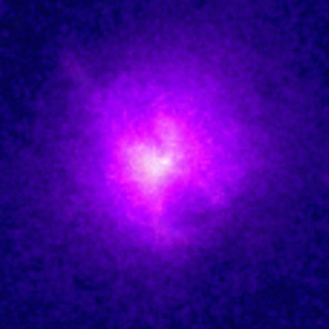
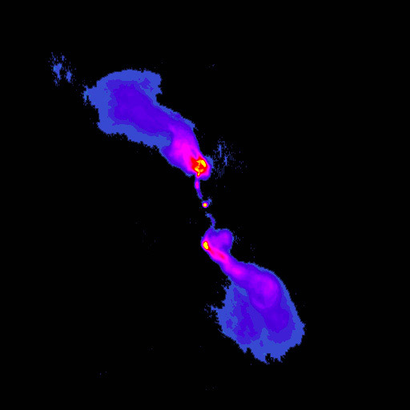
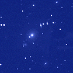
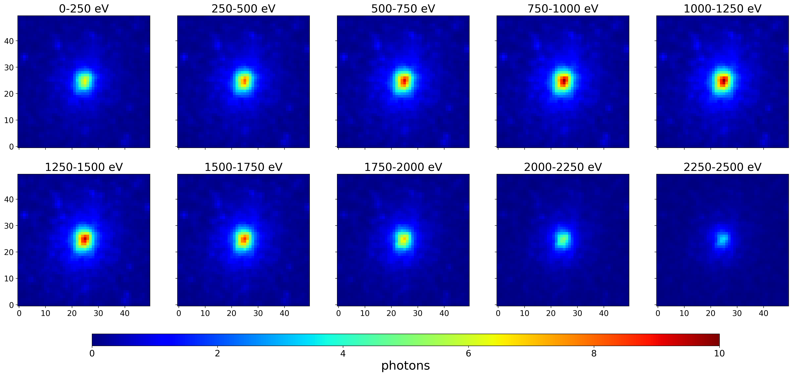

# Preparation

This preparation consists of three parts, the first sets up your computational environment, the second one provides a background on the physics
problem, and the third one provides preparation on the numerical methods used.

## Computational environment preparation


- Connect to jupyterhub at: [jupyter.physik.uni-muenchen.de](https://jupyter.physik.uni-muenchen.de). Further instructions, in particular regarding the necessary two factor identification can be found in the general introduction slides on Moodle and [here](https://collab.dvb.bayern/spaces/LMULMPHGST/pages/134212087/Jupyterhub). Note that the more resources (CPUs, GPUs, memory or time) you request for your session the harder it is to allocate them. Hence it is recommended to use only resources you actually need. As one often does not know the resources needed start with small resources which typically give you almost immediate access. When your jupyter kernel keeps crashing, this can be a sign that you are running out of memory.
- Clone repository on remote machines and generate your personal branch (using the terminal, a terminal window can be opened within your running jupyterhub):
```
git clone https://gitlab.physik.uni-muenchen.de/xray-clusters-group-a/ss25/
```
Initially, everyone works in their own branch of this repository. To do this, you can run:
```
cd xray-clusters-group-a
git branch your_individual_branch_name
git checkout your_individual_branch_name
```
Ensure that you can push your work to the repository. For instance, you can push your changes as follows from a terminal:
```
# ensure you are working in the correct branch
# ensure you are in the directory of the repository
git add .
git commit -m "your message about your changes here"
git push
```
You should see your changes on our gitlab server.

## Physics preparation

When applying a new numerical method on a different physics topic for the first
time, we are often in a situation where we have no clue of what the object is we
would like to apply our method on. Although some colleagues around you might
have some domain expertise, it is a vital skill to be able to obtain an
understanding of how your data fits into the bigger science question one is
trying to answer. This lab is about inferring the masses of galaxy clusters from X-ray data. Before looking at the data, let's take a high-level perspective on galaxy clusters observed in X-rays. One might come across an observation in X-rays which looks like this:<br>
<br>
As a comparison here are the images of the cluster in optical and radio frequencies:<br>


<br>
These images are taken from the website associated to one of the flagship X-ray
observatories, the Chandra X-ray telescope [link](https://chandra.harvard.edu/xray_sources/galaxy_clusters.html).

In the above spirit, let us build up or refresh our knowledge about galaxy clusters. To do this, the following few questions might be helpful and you are encouraged to gather information on it (spend 2 hours):

- What do we describe as clusters of galaxies? 
*[Is there some physics definition of the object we are interested in]*
    - Regular clusters of galaxies are the largest organized structures in the universe. They typically contain hundreds of galaxies. They are the second largest object inthe universe after superclasters (A supercluster is a large group of smaller galaxy clusters or galaxy groups).

- How large are clusters of galaxies (in relation to other objects galaxies)?
*[Which length scales are involved and how do other objects compare to it]*
    - They spread over a region of whose size is roughly $10^{25}$ cm, which translates into 1 to 5 **Mpc** (1 Mpc ≈ 3.26 million light-years). Typical masses range from $10^{14}$ to $10^{15}$ solar masses. 

    - In comparison, a typical **galaxy** such as the Milky Way has a diameter of about **26.8 kiloparsecs (kpc)**, or roughly **$10^{23}$ cm**, which is about **100 times smaller** than a galaxy cluster. The **Large Magellanic Cloud (LMC)** — a well-known satellite galaxy of the Milky Way — spans about **4.3 kpc** and is significantly less massive (around $10^{9}$ solar masses)

    - At even larger scales, **superclusters** — which are vast groupings of multiple galaxy clusters — can extend over **tens to hundreds of megaparsecs**, making them the largest known structures in the Universe. An example is the **Laniakea Supercluster**, which includes the Milky Way and spans over **500 million light-years $\simeq$ 153.37 Mpc**.

- What are clusters made of? *[Which physical dynamics are involved]*
    - Hundreds of galaxies containing stars, gas and dust;
    - Vast clouds of hot (30 - 100 million degrees Celsius) gas that is invisible to optical telescopes;
    - Dark matter, a mysterious form of matter that has so far escaped direct detection with any type of telescope, but makes its presence felt through its gravitational pull on the galaxies and hot gas

- Why can they not only be made of galaxies? *[Identifying special properties]*

    - The  velocities of galaxies within clusters are too high to be held together by the gravitational pull of galaxies alone. If only galaxies were present, the cluster would not be gravitationally bound — the galaxies would fly apart.

    - Clusters emit  X-rays from very the hot gas (30–100 million °C) found between the galaxies. This gas makes up much more mass than all the stars in the galaxies combined. It cannot be explained by stars or galaxies alone. This gas is only detactable in X-rays not in visible light!

    - Gravitational lensing shows that clusters contain far more mass than what’s visible in galaxies or even hot gas. Most of the mass must be in the form of dark matter.

- How does a galaxy cluster look like in the optical and in X-ray? *[Identifying what is special in the X-ray domain]*

    - In X-rays, the cluster appears as a purple-pink glow. 

    - We can map the gravitational distribution?


- What is the X-ray emission made of and which energy range do X-ray observations (Chandra, XMM, eROSITA) observe clusters in? *[Further keywords to guide the literature review]*

    - The X-ray continuum emission from a hot diffuse plasma is due primarily to three processes, **thermal bremsstrahlung** (free-free emission), **recombination** (free-bound) emission, and **two-photon decay of metastable levels**.
    
     -eRosita: X-ray range up to 10 keV
     -Chandra: up to 10 keV
     - XMM : 0.15 to 12 keV for the EPIC (European Photon Imaging Camera) instruments and 0.35 to 2.5 keV for the RGS (Reflection Grating Spectrometer) instruments.

- How can the mass distribution be modelled by observation of X-ray properties? In particular, what is the beta model in X-rays and how does it relate X-ray properties with the mass of the cluster (cf. chapter 5.5 (in particular 5.5.1) of [https://ned.ipac.caltech.edu/level5/March02/Sarazin/frames.html](https://ned.ipac.caltech.edu/level5/March02/Sarazin/frames.html))? *[What are relevant physical models?]*

    - The mass distribution of a galaxy cluster can be estimated by assuming that the hot intracluster gas is in **hydrostatic equilibrium** within the **gravitational potential** well of the cluster.

    - If the **gas density** and **temperature profiles** are known (from X-ray surface brightness and spectral data), we can derive the total gravitational mass profile.

    - **β-model**:

        - In X-ray astronomy, the **β-model** is a widely used  model to describe the distribution of hot gas in galaxy clusters, which is often observed via X-ray emissions. It assumes the intracluster gas is in **hydrostatic equilibrium** within the gravitational potential of the cluster, and that the gas is **isothermal**.

        - The  gas density profile is given by:

$$
\rho_g(r) = \rho_{g0} \left[1 + \left( \frac{r}{r_c} \right)^2 \right]^{-3\beta/2}
$$

where:
- $\rho_g(r)$ is the gas density at radius $ r $,
- $ \rho_{g0} $ is the central gas density,
- $ r_c $ is the core radius,
- $ \beta $ is a parameter related to the ratio of galaxy velocity dispersion to gas temperature.

- By projecting this profile along the line of sight, one obtains the X-ray surface brightness profile, which can be fit to observational data.

Under the assumption of an isothermal gas in hydrostatic equilibrium, the total gas mass $M_g$ of a galaxy cluster can be estimated using the β-model as:

$$
M_g = \pi^{3/2} \, \rho_{g0} \, r_c^3 \, \frac{\Gamma\left[ \frac{3\beta - 1}{2} \right]}{\Gamma\left[ \frac{3\beta}{2} \right]} \quad \text{for } \beta > 1
$$


$$
M_g = 3.15 \times 10^{12} \, M_\odot \left( \frac{n_0}{10^{-3} \, \text{cm}^{-3}} \right) \left( \frac{r_c}{0.25 \, \text{Mpc}} \right)^3 \frac{\Gamma\left[ \frac{3\beta - 1}{2} \right]}{\Gamma\left[ \frac{3\beta}{2} \right]}
$$

where:
- $n_0$ is the central gas number density,
- $r_c$ is the core radius of the cluster,
- $\beta$ is the slope parameter from the β-model,
- $\Gamma$ is the gamma function,
- $\rho_{g0}$ is the central gas density.

This relation allows to estimate the **gravitational mass profile** of the cluster from observed X-ray brightness and gas temperature.


*The comments in brackets denote the general direction this question is covering. This is removed for the students' version.*

**References:** You are very welcome to use your favourite references on this subject. For those in search of a concise overview, please take a look at [https://ned.ipac.caltech.edu/level5/March02/Sarazin/frames.html](https://ned.ipac.caltech.edu/level5/March02/Sarazin/frames.html) [note that you are not expected to know all of this content].  In case you need more literature, please reach out.

**Task preview:** *Based on our discussion of the basics and your preparation, one of you should summarise the basics of galaxy clusters (2-3 pages) for your joined lab report.*

Actual models for X-ray emission of galaxy clusters are more sophisticated (i.e. involve more physical effects to generate the X-ray spectrum). They are calibrated using inferred distributions of the relevant properties from previous observations of clusters. Such simulations have been generated in the preparation of the data collected with eROSITA and we are using products derived from these simulations here.

The relevant files can be found (here)[https://erosita.mpe.mpg.de/edr/eROSITAObservations/Catalogues/liuT/eFEDS_catalog_V3.3.html]. The information for our data is contained in the input cluster catalogue and the mock eFEDS event files (evt_*.fits). *If you are familiar with .fits files and are interested to take a look at the simulation data, please feel free to browse it. The relevant information is in the header of each of these files. If you are not familiar with .fits files, please move on for time reasons.*

These simulations were prepared for a particular patch in the sky where eROSITA took a deep observation before the all-sky scans started to estimate the expected results after the final survey.<br>
**References:** These simulations are described in [https://arxiv.org/abs/2008.08404](https://arxiv.org/abs/2008.08404), and in [https://arxiv.org/abs/2106.14528](https://arxiv.org/abs/2106.14528) respectively.

In the .fits file you would find many clusters but not all of them will be detected using the software pipeline eSASS, mostly because there are very faint sources which often feature only very few photons. There are two features which we base our selection on, this is the detection and the extend likelihood of the sources.

As we are interested in predicting the mass of a galaxy cluster from the photons associated to that cluster and there are many clusters in the entire field of the simulation we need to select a region where we keep the photons.

*In our prediscussion, we will discuss what a good size for the region where we extract the photons from. As a preparation, you might think about this question and which criteria you would apply to make this decision.*

Once we have the region of where we want to consider the photons, we need to put our photons into a format which is suitable for our machine learning algorithm. Here this is an image with several channels. The information in the channels is associated to the energy of a photon. The images have been processed further by rescaling them from the extraction size of 300x300 pixels to 50x50 pixels and secondly by smoothing the photon images with a Gaussian filter in all directions.

An image of one of our cluster images looks like this:<br>

<br>

For this experiment, we provide these images which have been generated from the simulation files. We have selected all clusters in the simulation files which match appropriate detection and extend likelihood cuts. This is the data which we will work with throughout this lab.

**Task 1:** *Download the images and the associated features from [here](https://syncandshare.lrz.de/getlink/fiWhjKsY9FYoB81tzXdF7m/) (or use direct commands from below) and put them in your local copy of your repository on the physics machine.*

Note that you can also run the following commands on your remote machine:
```
wget https://cloud.physik.lmu.de/index.php/s/5xex5aXqRYSdSMw/download/eFEDS_mock_clusters_catalog_01to18-ext_det_thr.f

wget https://cloud.physik.lmu.de/index.php/s/ParyrwygTYdFcWY/download/eFEDS_01to18-3dImgs-7946clus-300pix-50pix-ext_det_thr.pickle
```

**Task 2:** *Generate histograms of the mass distribution and the redshift distribution of our clusters respectively.*

## Machine learning preparation

The second part of the theory preparation is to familiarise yourself with neural networks relevant for vision tasks. In this lab course we will use tensorflow and in particular keras for our neural networks. Some background on convolutional neural networks can be found in [Goodfellow et al](https://www.deeplearningbook.org). In recent years it has been realised that there is a profound relation between networks like a CNN and symmetry properties, i.e. the CNNs are equivariant with respect to translations (see [https://arxiv.org/abs/2104.13478](https://arxiv.org/abs/2104.13478) for more details if you are interested).

A short tutorial on networks used for image classification can be found here: https://www.tensorflow.org/tutorials/images/cnn.<br>
After your preparation you should be somewhat familiar with the following concepts:
- Which components/layers does a standard CNN include?
    - **Input layer** 
    - **Convolutional layers (`Conv2D`)**: 
    - **Activation functions** 
    - **Pooling layers** 
    - **Dropout layers** 
    - **Fully connected  layers**
    - **Output layer** 
- How does a standard convolution layer work and what do the relevant hyperparameters (kernel size, filters, stride, padding) stand for?
    - A **convolutional layer** applies  filters (kernels) across the input image.

    - **Kernel size**:  
    The size of the filter   

    - **Filters**:  
    Each filter outputs one **feature map**, so `filters=32` gives 32 channels (feature maps).

    - **Stride**:  
    How many pixels the filter shifts at a time.  
    - `stride=1`: moves pixel by pixel  
    - `stride=2`: skips every other pixel (downsizing)

    - **Padding**:  
    Determines whether the input is padded around the border (add pixels with 0 value around the image)

- How does a simple pooling layer such as maxpooling work?

    **MaxPooling** reduces spatial resolution while keeping key features.

- It divides the feature map into regions (e.g., `2×2`)
- For each region, it keeps only the **maximum value**

- What is the difference between a CNN and a dense/fully connected neural network?

    - In CNN we have filters that capture local correlations
    - In FNN we capture global features
    - A CNN is a subcase of an FNN because if we apply a filter with size that of the image we get a FNN
    - In CNNs we have weight sharing
    - CNNs are used for image data while FNNs for tabular data

- How do I train a CNN for image classification on CIFAR10, i.e. rerun the code quoted in the tutorial? Note that this can be a very good check that your virtual environment is set up appropriately.

**Task 4:** *Familiarise yourself with the above concepts.*

**Task 5:** *Generate a list of questions you have regarding neural networks such that we can discuss them in the pre-discussion.*

Note that some further guides on machine learning, neural networks, and python in general can be found in [mlandpythonbasics.md](guides/mlandpythonbasics.md).

**Task 6:** *How do I need to set up the architecture of a neural network for a regression task (e.g. in comparison to a classification task)?*

We are interested in estimating the error associated to the predictions of our neural network. To do this, we are interested in predicting the mean and standard deviation of a Gaussian for any given image. Given this assumption of a Gaussian, we can evaluate the conditional probability $`p(y|x,\theta)`$ where $`y`$ denotes the mass in our dataset, $x$ the image, and $`\theta`$ summarises our neural network parameters. In particular we obtain:
```math
p(y|x,\theta)=\frac{1}{\sqrt{2\pi\sigma(x,\theta)^2}}\exp{\left(\frac{(y-f(x,\theta))^2}{2\sigma(x,\theta)^2}\right)}.
```

We will be interested in implementing the log-likelihood of this quantity.

**Task 7:** *As a preparation it is useful to derive the expression for the log-likelihood, i.e. $`\log{p(y|x,\theta)}`$. You should see that there are two relevant terms for our optimisation.*

Please remember to read through the labday.md and labreport.md to finish your preparation.
